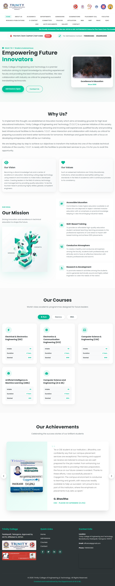

# TCEK Website (PHP)

**Live Website:** [https://tcek-ac-in.vercel.app/](https://tcek-ac-in.vercel.app/)



This repository contains the source code for the **Trinity College of Engineering and Technology, Peddapally (TCEK)** website, built using vanilla PHP, HTML, and CSS.

## 📂 Project Structure

The project is specialized for deployment on Vercel while maintaining a standard PHP application structure.

The project is specialized for deployment on Vercel while maintaining a standard PHP application structure.

```txt
tcek.in-php/
├── api/
│   └── index.php                   # Vercel entry point (Router/Proxy)
├── php/                            # Local PHP binaries and config (for development)
├── public/                         # Web root directory (Publicly accessible)
│   ├── assets/                     # Static Assets
│   │   ├── Desirable-AICTE/        # AICTE Desirable Documents (PDFs)
│   │   ├── Essentials-AICTE/       # AICTE Essential Documents (PDFs)
│   │   └── img/                    # Website Images (Logos, Banners, Gallery)
│   ├── css/                        # Stylesheets
│   │   ├── style.css               # Main stylesheet
│   │   └── ...                     # Other CSS files
│   ├── js/                         # JavaScript files
│   │   ├── main.js                 # Main JavaScript logic
│   │   └── ...                     # Other JS files
│   ├── components/                 # (Conceptual) Includes
│   │   ├── header.php              # Global Navigation and Header
│   │   ├── footer.php              # Global Footer
│   │   └── head.php                # Meta tags and CSS links
│   ├── Main Pages:
│   │   ├── index.php               # Home Page
│   │   ├── about-us.php            # About College
│   │   ├── contact.php             # Contact Information
│   │   ├── admission.php           # Admission Details
│   │   ├── gallery.php             # Photo Gallery
│   │   ├── facilities.php          # Campus Facilities
│   │   └── ...
│   ├── Department Portals:
│   │   ├── departments.php         # Departments Overview
│   │   ├── dept-cse.php            # Computer Science & Engineering
│   │   ├── dept-ece.php            # Electronics & Communication
│   │   ├── dept-eee.php            # Electrical & Electronics
│   │   ├── dept-hs.php             # Humanities & Sciences
│   │   ├── dept-mba.php            # MBA Department
│   │   ├── dept-aiml.php           # AI & ML Department
│   │   └── ...
│   ├── Accreditation & Compliance:
│   │   ├── naac.php                # NAAC Overview
│   │   ├── naac-criteria-*.php     # NAAC Criteria 1-7 Details
│   │   ├── aicte-essentials.php    # AICTE Essential Disclosures
│   │   ├── aicte-desirable.php     # AICTE Desirable Disclosures
│   │   ├── nirf.php                # NIRF Ranking Data
│   │   └── policies.php            # College Policies
│   └── Examination & Resources:
│       ├── examinations.php        # Exam Branch
│       ├── library.php             # Library Info
│       ├── placement-cell.php      # Placement Cell
│       ├── student-grievance.php   # Grievance Redressal
│       └── ...
└── vercel.json                     # Vercel Serverless Configuration
```

### Key Directories

- **`public/`**  
  The root directory for the web application. It contains all the visible pages and assets.
  - **Pages**: `index.php`, `about-us.php`, `contact.php`, and department pages like `dept-cse.php`.
  - **Components**: `header.php`, `footer.php`, `head.php` (reusable layout parts).
  - **Assets**: `assets/` (images, PDFs), `css/`, `js/`.
  - **Accreditation**: `naac.php`, `aicte-essentials.php`, `aicte-documents.php` and their related sub-pages.

- **`api/`**  
  Contains the backend entry point for Vercel Serverless Functions.
  - `index.php`: Acts as a router/proxy to serve files from the `public/` directory in the Vercel environment.

- **`php/`**  
  Contains local PHP binaries and extensions. This folder allows for specific PHP runtime configurations involved in local testing or specific deployment scripts.

- **`vercel.json`**  
  Configuration file for Vercel. It sets up routes to handle static assets and directs dynamic requests to `api/index.php`.

## 🚀 Getting Started

### Prerequisites
- [PHP 8.0+](https://www.php.net/downloads)
- [Composer](https://getcomposer.org/) (optional, if dependencies are added later)

### Running Locally
To run the project on your local machine:

1. **Clone the repository**:
   ```bash
   git clone https://github.com/saicharan-bhuthkuri/tcek.in-php.git
   cd tcek.in-php
   ```

2. **Start the built-in PHP server**:
   You can run the server directly from the `public` directory to mimic the web root.
   ```bash
   cd public
   php -S localhost:8000
   ```

3. **Browse the site**:
   Open [http://localhost:8000](http://localhost:8000) in your web browser.

## 🛠️ Deployment

This project is designed to be deployed on **Vercel** with the `vercel-php` runtime.

### Configuration (`vercel.json`)
The configuration ensures that:
- Requests to `/assets`, `/css`, and `/js` are served directly from `public/`.
- All other requests are routed to `api/index.php` for processing.

### Directory Handling
The `api/index.php` script automatically maps URLs to the corresponding `.php` files in the `public/` directory, allowing for clean URLs (e.g., `/about-us` loads `public/about-us.php`).

## 📚 Features

- **Responsive Design**: tailored for both desktop and mobile viewing.
- **Department Portals**: Detailed pages for EEE, ECE, CSE, etc., with tabs for About, Faculty, Labs, etc.
- **Dynamic Navigation**: Active state highlighting for navigation menus.
- **Documentation**: Extensive sections for NAAC and AICTE mandatory disclosures.


